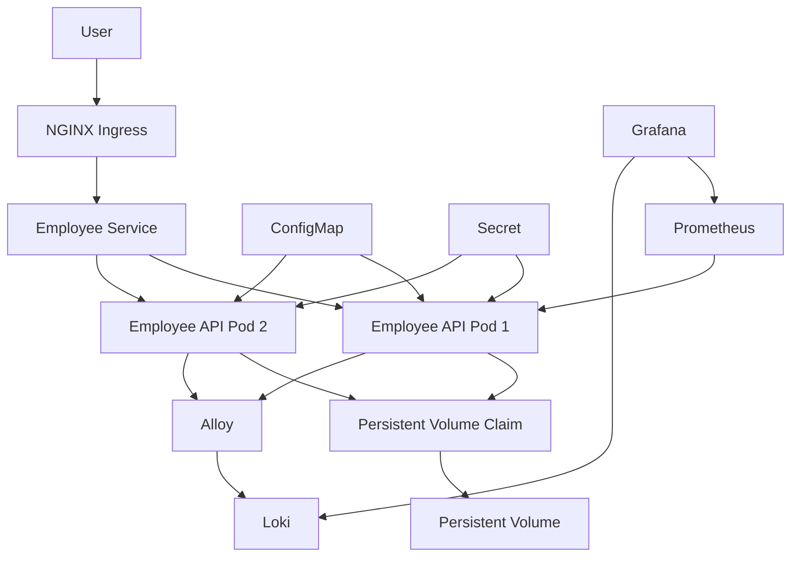

                Internet
                    │
                    ▼
              NGINX Ingress
                    │
                    ▼
             Kubernetes Service
                    │
                    ▼
             Deployment (2-10 Pods)
                    │
        ┌───────────┴───────────┐
        ▼                       ▼
     ConfigMap              Secret
        │                       │
        └───────────┬───────────┘
                    ▼
              Flask Application
                    │
                    ▼
                  PVC/PV

Prometheus ───────────────► Metrics

Grafana ◄────────────────── Prometheus

