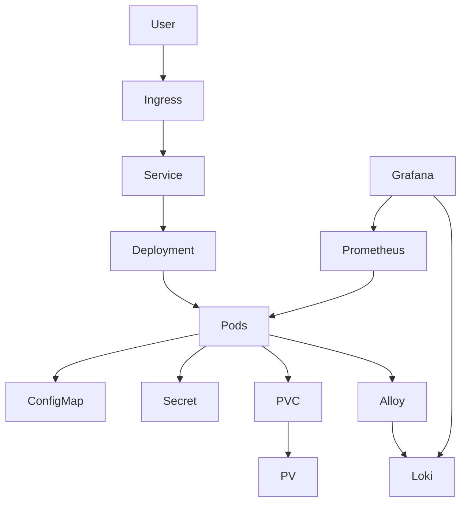

# 🏗️ System Architecture

## Overview

Employee Platform is a production-inspired cloud-native application designed to demonstrate modern DevOps practices. The application runs on Kubernetes using Helm and includes monitoring, logging, security, and CI/CD components.

---

## High-Level Architecture

---

# Components

## Application

- Flask REST API
- Health endpoints
- Metrics endpoint
- Dockerized application

---

## Kubernetes

The application runs inside a Kubernetes cluster created using Kind.

Resources include:

- Namespace
- Deployment
- Service
- Ingress
- ConfigMap
- Secret
- PersistentVolume
- PersistentVolumeClaim
- ServiceAccount
- Role
- RoleBinding
- HorizontalPodAutoscaler

---

## Helm

Helm manages every Kubernetes resource using reusable templates.

Configuration is controlled through:

- values.yaml
- Helper templates
- Environment-specific values

---

## Storage

Persistent storage is provided through:

- PersistentVolume
- PersistentVolumeClaim

The application writes data to persistent storage instead of the container filesystem.

---

## Monitoring

Prometheus collects metrics from the application.

Metrics include:

- Request count
- Request duration
- Pod health
- Resource usage

Grafana visualizes the collected metrics.

---

## Logging

Application logs are written to stdout.

Grafana Alloy collects logs and forwards them to Loki.

Grafana queries Loki for centralized log analysis.

---

## Security

The application follows Kubernetes security best practices.

Implemented controls include:

- Non-root container
- Security Context
- RBAC
- Kubernetes Secrets
- Resource requests and limits

---

## CI/CD

GitHub Actions automates:

- Code formatting
- Linting
- Unit testing
- Docker image build
- Vulnerability scanning
- Docker Hub publishing
- Helm validation

Deployment automation will be extended in future iterations.

---

## Future Improvements

- Argo CD
- GitOps
- OpenShift
- External Secrets Operator
- HashiCorp Vault
- Service Mesh