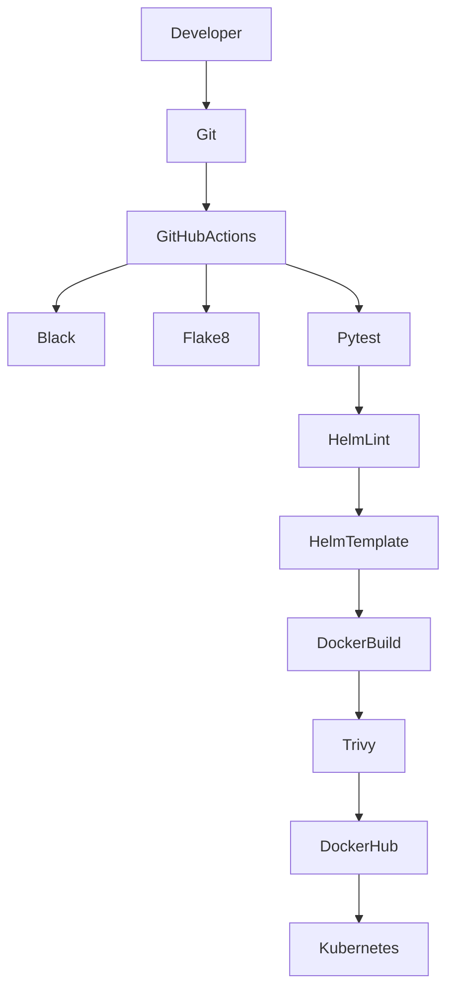

# 🚀 CI/CD Pipeline

## Overview

This project uses GitHub Actions to automate the software delivery process.

The CI/CD pipeline validates code quality, builds Docker images, scans for vulnerabilities, packages Kubernetes manifests, and prepares the application for deployment.

---

# Pipeline Architecture



---

# Pipeline Stages

## Stage 1 - Source Code Validation

Purpose:

- Verify code formatting
- Detect syntax issues
- Execute unit tests

Tools:

- Black
- Flake8
- Pytest

---

## Stage 2 - Helm Validation

Purpose:

Validate Kubernetes manifests before deployment.

Commands:

```bash
helm lint helm/employee-api

helm template employee-api ./helm/employee-api
```

---

## Stage 3 - Docker Build

Purpose:

Create a production-ready container image.

Example:

```bash
docker build -t employee-api .
```

The pipeline tags images using:

- Git SHA
- latest

---

## Stage 4 - Security Scan

Container images are scanned using Trivy.

Purpose:

- Detect vulnerabilities
- Fail builds on HIGH and CRITICAL issues

Example:

```bash
trivy image employee-api
```

---

## Stage 5 - Push Image

After a successful scan, the image is pushed to Docker Hub.

Repository:

```
<dockerhub-username>/employee-api
```

Tags:

- latest
- Git SHA

---

## Future Stage - Deployment

Deployment will use Helm.

```bash
helm upgrade --install employee-api \
./helm/employee-api \
--namespace employee \
--create-namespace
```

---

# Workflow Files

```text
.github/

└── workflows/

    ci.yml
```

Future:

```text
.github/

└── workflows/

    ci.yml

    release.yml

    deploy.yml
```

---

# Pipeline Flow

```text
Developer

↓

Git Push

↓

GitHub Actions

↓

Code Quality Checks

↓

Unit Tests

↓

Helm Validation

↓

Docker Build

↓

Security Scan

↓

Docker Hub

↓

Deployment
```

---

# Secrets

GitHub Secrets required:

| Secret | Description |
|---------|-------------|
| DOCKERHUB_USERNAME | Docker Hub username |
| DOCKERHUB_TOKEN | Docker Hub access token |

---

# Branch Strategy

```text
feature/*

↓

Pull Request

↓

main
```

Every push triggers the CI workflow.

---

# Quality Gates

The pipeline fails if:

- Black formatting fails
- Flake8 reports errors
- Unit tests fail
- Helm lint fails
- Helm template fails
- Docker build fails
- Trivy detects HIGH or CRITICAL vulnerabilities

---

# Benefits

- Automated validation
- Consistent builds
- Repeatable deployments
- Security scanning
- Early bug detection
- Immutable container images

---

# Future Improvements

Planned enhancements:

- Helm chart packaging
- Automated releases
- Argo CD deployment
- GitOps workflow
- Smoke tests
- Automatic rollback
- Multi-environment deployment