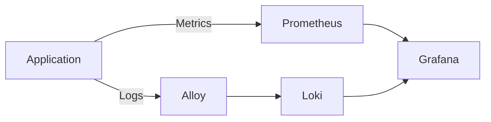

# 📊 Observability

## Overview

Observability enables engineers to understand the health and behavior of applications running in Kubernetes.

This project implements a complete observability stack consisting of:

- Prometheus
- Grafana
- Loki
- Grafana Alloy

Together they provide metrics, visualization, centralized logging, and operational insights.

---

# Architecture



---

# Components

## Prometheus

Prometheus collects application and Kubernetes metrics.

Responsibilities:

- Scrape application metrics
- Store time-series data
- Monitor Kubernetes resources
- Evaluate alert rules

---

## Grafana

Grafana visualizes metrics and logs.

Dashboards include:

- Application Metrics
- Kubernetes Cluster
- Node Metrics
- Pod Metrics
- Container Metrics
- Loki Log Explorer

---

## Loki

Loki stores application logs.

Unlike Elasticsearch, Loki indexes labels instead of the full log content, making it lightweight and efficient.

Responsibilities:

- Store application logs
- Enable log search
- Support log filtering
- Integrate with Grafana

---

## Grafana Alloy

Grafana Alloy collects logs from Kubernetes.

Responsibilities:

- Discover Pods
- Read container logs
- Attach Kubernetes labels
- Forward logs to Loki

---

# Monitoring Flow

```text
Application

↓

Metrics Endpoint

↓

Prometheus

↓

Grafana Dashboard
```

---

# Logging Flow

```text
Application

↓

stdout

↓

Grafana Alloy

↓

Loki

↓

Grafana Explore
```

---

# Installed Components

| Component | Namespace |
|-----------|-----------|
| Prometheus | monitoring |
| Grafana | monitoring |
| Loki | monitoring |
| Grafana Alloy | monitoring |

---

# Verify Installation

## Prometheus

```bash
kubectl get pods -n monitoring
```

Expected:

- Prometheus Running

---

## Grafana

```bash
kubectl get svc -n monitoring
```

Port Forward

```bash
kubectl port-forward svc/monitoring-grafana 3000:80 -n monitoring
```

Open:

```
http://localhost:3000
```

---

## Loki

Verify:

```bash
kubectl get pods -n monitoring
```

Expected:

- loki-gateway
- loki-minio
- loki-canary

---

## Alloy

Verify:

```bash
kubectl get pods -n monitoring -l app.kubernetes.io/name=alloy
```

---

# Verify Metrics

Prometheus Targets

Navigate to:

```
Status → Targets
```

Expected:

- Kubernetes API
- Node Exporter
- kube-state-metrics
- Employee API

---

# Verify Logs

Open Grafana.

Navigate:

```
Explore

↓

Select Loki
```

Query

```
{namespace="employee"}
```

Expected:

Application logs should appear.

---

# Useful Commands

View application logs

```bash
kubectl logs deployment/employee-api -n employee
```

View Alloy logs

```bash
kubectl logs -n monitoring \
-l app.kubernetes.io/name=alloy
```

View Loki logs

```bash
kubectl logs -n monitoring deployment/loki-gateway
```

---

# Dashboards

Recommended dashboards:

- Kubernetes Cluster Overview
- Node Exporter
- Kubernetes Compute Resources
- Pod Metrics
- Employee API Metrics

---

# Common Issues

## No Metrics

Check:

```bash
kubectl get servicemonitor
```

Verify Prometheus targets.

---

## No Logs

Check Alloy logs.

Verify:

- Alloy is running
- Loki is reachable
- Labels are configured correctly

---

## Grafana Cannot Connect

Verify:

```bash
kubectl get svc -n monitoring
```

Check the Loki datasource configuration.

---

# Best Practices

- Use structured JSON logs whenever possible.
- Label logs consistently.
- Keep dashboard names descriptive.
- Monitor CPU and memory requests.
- Create alerts for critical services.
- Separate dashboards by application and infrastructure.

---

# Future Enhancements

- Alertmanager integration
- Slack notifications
- Microsoft Teams notifications
- Tempo distributed tracing
- OpenTelemetry
- SLO and SLA dashboards