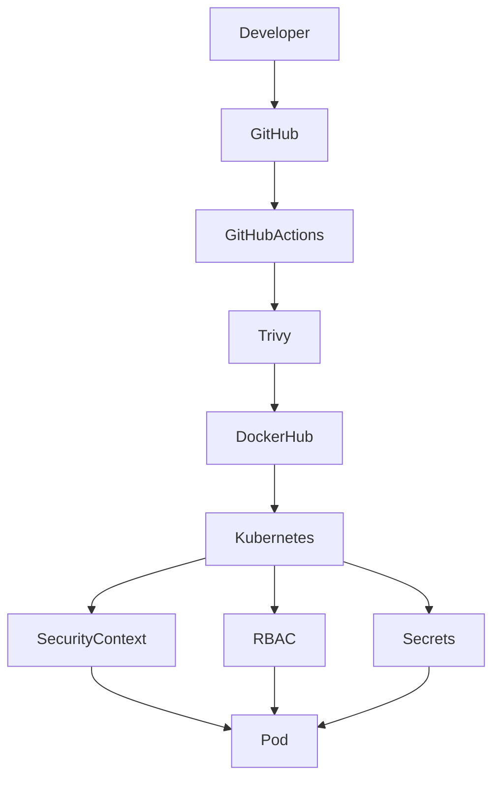

# 🔒 Security

## Overview

Security is a fundamental part of this project. Every component has been designed to follow Kubernetes and container security best practices while remaining simple enough for learning purposes.

The goal is to demonstrate production-inspired security practices rather than relying on default configurations.

---

# Security Architecture



---

# Container Security

## Non-root User

The application runs as a non-root user.

Benefits:

- Prevents root access inside the container.
- Reduces the impact of container compromise.
- Complies with Kubernetes security recommendations.

Example:

```yaml
securityContext:
  runAsNonRoot: true
  runAsUser: 1000
```

---

## Read-only Root Filesystem

Where possible, containers should use a read-only root filesystem.

Benefits:

- Prevents runtime modification.
- Reduces persistence opportunities for attackers.

Example:

```yaml
securityContext:
  readOnlyRootFilesystem: true
```

---

## Disable Privilege Escalation

Containers should never gain additional privileges during execution.

Example:

```yaml
allowPrivilegeEscalation: false
```

---

# Kubernetes Security

## RBAC

Role-Based Access Control restricts Kubernetes API permissions.

This project uses:

- ServiceAccount
- Role
- RoleBinding

The application receives only the permissions it requires.

---

## Service Account

A dedicated ServiceAccount is used instead of the default account.

Benefits:

- Better isolation.
- Easier auditing.
- Least privilege.

---

# Secrets

Sensitive values are stored using Kubernetes Secrets.

Examples:

- Database password
- API keys
- Tokens

Secrets are mounted into Pods rather than hardcoded into application code.

---

## Important Note

Kubernetes Secrets are Base64 encoded.

Base64 is **not encryption**.

For production environments consider:

- HashiCorp Vault
- External Secrets Operator
- AWS Secrets Manager
- Azure Key Vault

---

# Network Security

Current implementation:

- Kubernetes Service
- NGINX Ingress

Future improvements:

- Network Policies
- mTLS
- Service Mesh

---

# Image Security

Docker images are scanned using Trivy during CI.

Pipeline fails when:

- HIGH vulnerabilities are detected.
- CRITICAL vulnerabilities are detected.

Example:

```bash
trivy image employee-api
```

---

# Resource Limits

Every workload should define CPU and memory requests.

Example:

```yaml
resources:
  requests:
    cpu: 100m
    memory: 128Mi

  limits:
    cpu: 500m
    memory: 512Mi
```

Benefits:

- Prevent noisy neighbors.
- Improve scheduling.
- Support HPA.

---

# Health Checks

The application exposes:

- Startup Probe
- Readiness Probe
- Liveness Probe

Benefits:

- Faster recovery.
- Safer rolling updates.
- Improved availability.

---

# Helm Security

Configuration is externalized using:

- ConfigMaps
- Secrets
- values.yaml

Sensitive data is not stored directly inside templates.

---

# CI/CD Security

GitHub Actions validates:

- Code formatting
- Linting
- Unit testing
- Docker build
- Image scanning
- Helm validation

Secrets are stored using GitHub Actions Secrets.

---

# Security Best Practices Implemented

- ✅ Non-root containers
- ✅ Dedicated ServiceAccount
- ✅ RBAC
- ✅ Kubernetes Secrets
- ✅ Resource requests and limits
- ✅ Health probes
- ✅ Trivy image scanning
- ✅ Helm templating
- ✅ Immutable container images
- ✅ Docker Hub access tokens

---

# Future Enhancements

Planned security improvements:

- External Secrets Operator
- HashiCorp Vault
- Network Policies
- Pod Security Admission
- Kyverno Policies
- OPA Gatekeeper
- Cosign image signing
- SBOM generation
- Falco runtime security
- Cert-Manager